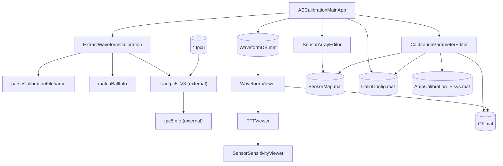
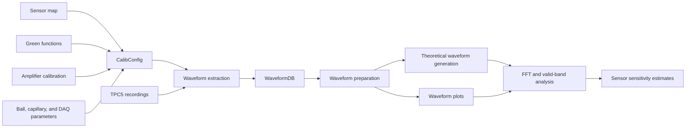

# CalibWave Code Architecture Analysis

## Scope and Method

This report was initially produced on 2026-06-12 and has been updated after the recommended modular refactor was implemented. The analysis combines static inspection, MATLAB's `matlab.codetools.requiredFilesAndProducts`, application constructor smoke tests, and automated tests.

## Implementation Status

The recommended architecture is now implemented:

- Six UI classes live in `apps/` and delegate reusable work to package functions.
- Domain code is organized under `+calibwave` by configuration, geometry, I/O, physics, signal processing, sensitivity, and plotting responsibility.
- TPC5 MATLAB source is vendored under `external/tpc5/`.
- MAT resources live under `resources/`.
- Unit and integration tests live under `tests/`.
- `setupCalibWave.m` configures the project, app, and TPC5 source paths.

The automated suite contains 14 passing tests. Constructors for the five apps that do not require loaded waveform data also pass smoke testing.

## Executive Summary

The project contains three main workflows:

1. Build sensor and calibration configuration data.
2. Extract waveforms from TPC5 acquisition files into `WaveformDB`.
3. View waveforms, generate theoretical responses, analyze spectra, and estimate sensor sensitivity.

The project now separates App Designer orchestration from reusable domain and signal-processing code. App classes retain callbacks, plotting interaction, and workflow state, while package functions own geometry, persistence, physical source models, FFT processing, and sensitivity calculations.

TPC5 source resolution is now deterministic. Real TPC5 import still requires the proprietary Elsys assembly under `external/tpc5/references/x64/` or `x86/`; the project reports a clear error when it is absent.

## Source Inventory

| File | Role | App Designer coupling |
|---|---|---|
| `apps/*.m` | Six App Designer UI and workflow classes | UI layer |
| `+calibwave/+config` | Schema construction and validation | UI-independent |
| `+calibwave/+geometry` | Sensor-grid construction and label merging | UI-independent |
| `+calibwave/+io` | Parsing, extraction, MAT persistence, dependency checks | UI-independent |
| `+calibwave/+physics` | Green functions and physical source/waveform models | UI-independent |
| `+calibwave/+signal` | Alignment, arrival picking, trigger and FFT operations | UI-independent |
| `+calibwave/+sensitivity` | Valid-band and sensitivity calculations | UI-independent |
| `+calibwave/+plotting` | Shared plotting and export helpers | Graphics-handle dependent, AppBase independent |
| `external/tpc5` | Vendored TPC5 MATLAB importer source | External integration |
| `resources/*.mat` | Green-function and amplifier calibration data | Data dependency |

## Dependency Graph

### File and Application Dependencies



### Runtime Data Flow



### Direct Internal Calls

| Caller | Callee |
|---|---|
| `AECalibrationMainApp` | `SensorArrayEditor`, `CalibrationParameterEditor`, `ExtractWaveformCalibration` |
| `ExtractWaveformCalibration` | `loadtpc5_V3`, `parseCalibrationFilename`, `matchBallInfo` |
| `WaveformViewer` | `FFTViewer` |
| `FFTViewer` | `WaveformViewer.prepareFFTPlotData`, `SensorSensitivityViewer` |
| `WaveformViewer` | `SensorSensitivityViewer` during batch sensitivity export |

`WaveformViewer` and `FFTViewer` also contain dense internal method graphs. Their computational cores are listed in the UI-independent section below.

## External Dependencies

MATLAB's dependency analyzer reported:

| Product | Detected version | Why it is needed |
|---|---:|---|
| MATLAB | 24.2 | Apps, tables, plotting, optimization functions, MAT I/O |
| Signal Processing Toolbox | 24.2 | `blackmanharris` |
The Statistics and Machine Learning Toolbox dependency was removed by replacing `geomean` with an equivalent log-domain calculation and `range` with `diff`.

External source dependencies are now vendored:

- `external/tpc5/loadtpc5_V3.m`
- `external/tpc5/tpc5Info.m`

The proprietary `Elsys.HdfFiles.dll` and its supporting vendor files are not currently present. They must be copied into the importer's expected `references/x64` or `references/x86` folder for real TPC5 extraction.

Other notable MATLAB APIs include `fft`, `conv`, `interp1`, `fminsearch`, `exportgraphics`, and `writetable`.

## Functions Independent of App Designer Objects

All reusable functions under these packages are independent of App Designer objects:

| Package | Functions |
|---|---|
| `calibwave.config` | `buildCalibConfig`, `validateCalibConfig`, `validateWaveformDB` |
| `calibwave.geometry` | `createSensorArray`, `mergeLabelsIntoGrid` |
| `calibwave.io` | Filename parsing, ball matching, TPC5 extraction, MAT load/save, TPC5 installation validation |
| `calibwave.physics` | Green-function selection, arrival metadata, ball/capillary source and theoretical waveform generation |
| `calibwave.signal` | Signal alignment, AIC arrival picking, source/trigger time, FFT, spectrum cropping and resampling |
| `calibwave.sensitivity` | Omega fitting, noise crossing, sensitivity curves/vectors, summaries and robust averaging |

Functions in `calibwave.plotting` accept graphics handles but do not depend on an `AppBase` instance. Compatibility methods retained on app classes are now thin delegating wrappers.

UI state orchestration remains intentionally inside the apps. The main example is `FFTViewer.computeSensorSensitivityFromAllSources`, which iterates the parent viewer's selected modes to prepare multiple datasets; all numerical processing it invokes is package-based.

## Implemented Modular Folder Structure

Use MATLAB package folders so names remain explicit and collisions with unrelated MATLAB path entries are reduced.

```text
CalibWave/
|-- apps/
|   |-- AECalibrationMainApp.m
|   |-- CalibrationParameterEditor.m
|   |-- SensorArrayEditor.m
|   |-- WaveformViewer.m
|   |-- FFTViewer.m
|   `-- SensorSensitivityViewer.m
|-- +calibwave/
|   |-- +config/
|   |   |-- buildCalibConfig.m
|   |   |-- validateCalibConfig.m
|   |   `-- validateWaveformDB.m
|   |-- +geometry/
|   |   |-- createSensorArray.m
|   |   `-- mergeLabelsIntoGrid.m
|   |-- +io/
|   |   |-- extractWaveformCalibration.m
|   |   |-- parseCalibrationFilename.m
|   |   |-- matchBallInfo.m
|   |   |-- loadSensorMap.m
|   |   |-- loadCalibrationConfig.m
|   |   `-- saveWaveformDB.m
|   |-- +physics/
|   |   |-- getGreenFunctionByOffset.m
|   |   |-- makeBallDropSourceFunction.m
|   |   |-- makeCapillaryForceFunction.m
|   |   |-- computeBallTheoreticalWaveform.m
|   |   `-- computeCapillaryTheoreticalWaveform.m
|   |-- +signal/
|   |   |-- alignAndAppend.m
|   |   |-- pickArrivalAIC.m
|   |   |-- getTriggerSampleIndex.m
|   |   |-- computeAmplitudeFFT.m
|   |   |-- cropSpectrum.m
|   |   `-- resampleSpectrumLog.m
|   |-- +sensitivity/
|   |   |-- fitOmegaModel.m
|   |   |-- findNoiseExceedFrequency.m
|   |   |-- computeSensitivityVector.m
|   |   |-- computeSensitivityCurve.m
|   |   `-- robustAverageSensitivity.m
|   `-- +plotting/
|       |-- exportAxes.m
|       `-- plotSensitivity.m
|-- external/
|   `-- tpc5/
|       |-- loadtpc5_V3.m
|       `-- tpc5Info.m
|-- resources/
|   |-- GF.mat
|   `-- AmpCalibration_Elsys.mat
|-- examples/
|   `-- data/
|       |-- ball_drop/
|       `-- capillary_fracture/
|-- tests/
|   |-- unit/
|   |-- integration/
|   `-- fixtures/
`-- CodeArchitecture.md
```

Example acquisition files are stored under `examples/data` rather than `resources` because they demonstrate application workflows and are not application assets or production data. The current examples contain 30 ball-drop TPC5 files and 22 capillary-fracture TPC5 files.

If the app files are renamed or callers are updated, they may instead live under `+calibwave/+apps/`. Keeping them in a plain `apps/` folder initially minimizes migration risk.

## Recommended Module Boundaries

### App Layer

The six app classes should own only:

- Widget creation and callback registration.
- Reading values from controls and displaying results.
- File/folder selection dialogs and user alerts.
- Plot rendering, viewport interaction, and application lifecycle.
- Calling domain functions with explicit inputs.

### Domain and Signal Layer

Package functions should own:

- Sensor geometry creation and map merging.
- Ball-drop and capillary source models.
- Green-function selection and theoretical convolution.
- Arrival picking and trigger calculations.
- FFT calculation, spectral resampling, valid-band estimation, and sensitivity aggregation.

These functions should not accept an app object, axes handle, dropdown, or edit-field handle.

### I/O Layer

I/O functions should isolate:

- TPC5 import and third-party loader behavior.
- MAT-file schema checks.
- Conversion between loaded structs and validated project data structures.
- Saving `SensorMap`, `CalibConfig`, `WaveformDB`, and sensitivity exports.

## Architectural Findings and Risks

1. **The proprietary TPC5 assembly is still required.** MATLAB source is vendored, but real imports cannot run until the Elsys `references` directory is supplied.
2. **Sensitivity batch orchestration still drives parent UI state.** Numerical processing is independent, but `computeSensorSensitivityFromAllSources` temporarily changes parent controls to generate datasets. A future data-first plot-data builder would remove this final workflow coupling.
3. **Amplifier calibration remains unused downstream.** `AmpCalibration_Elsys` is persisted in `CalibConfig.DAQ`, but no waveform or FFT path applies it. This needs a domain decision rather than an architectural guess.
4. **Filename parsing retains the historical naming assumption.** Ball diameter parsing expects adjacent integer and single-decimal tokens such as `1_5`. The behavior is now tested, but broader formats require an explicit specification.
5. **Schemas remain MATLAB structs.** Central validation now covers `CalibConfig` and top-level `WaveformDB`, but `PlotData` and `SensData` could use dedicated validators as their formats evolve.

## Verification

- MATLAB Code Analyzer completed without syntax errors.
- MATLAB dependency analysis resolves all project source through `apps/`, `+calibwave`, and `external/tpc5`.
- Required products: MATLAB 24.2 and Signal Processing Toolbox 24.2.
- Four primary app constructors plus `SensorSensitivityViewer` passed smoke testing.
- All 14 unit and integration tests pass.
